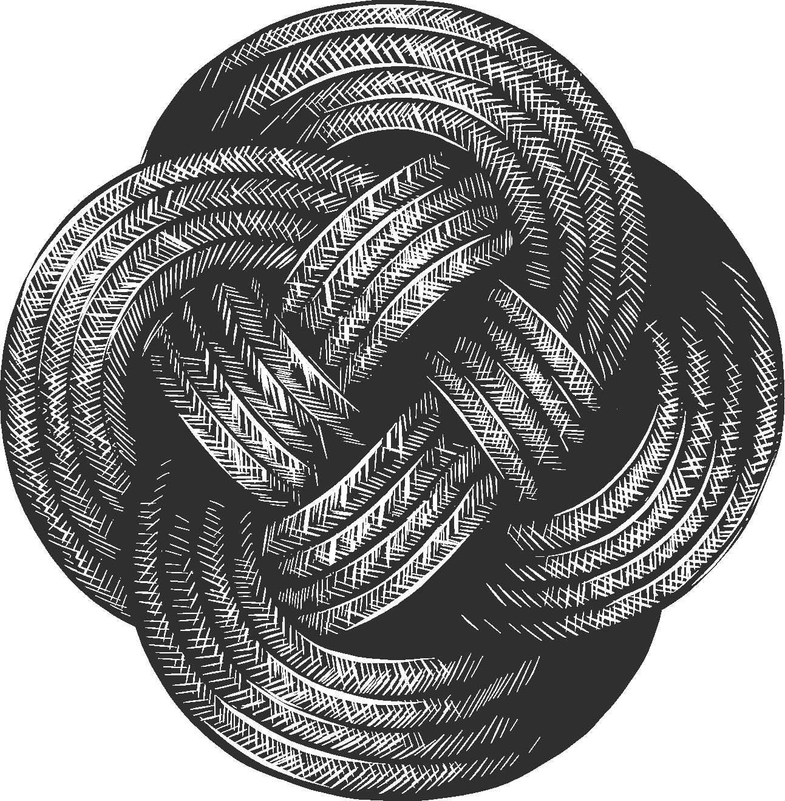

## Utopia

A self-propagating stack of infinitive-basis, built on L2 (LAMP 2.0).



The stack is organized as:

- ap(**U**), system files for a working Linux client/server distro
- ap(**T**), resource files for non-functioning items like images and documents
- ap(**O**), project files for external frameworks like [Android](https://www.android.com) and [iOS](https://developer.apple.com/ios/)
- ap(**P**), application files for internal site framework using HTML, CSS, and JS
- ap(**I**), service files for server processes to handle data, mail, etc.
- ap(**A**), site index that ties everything together

The LAMP 2.0 build (**L2**) includes:

- [Linux](https://en.wikipedia.org/wiki/Linux)
- [Arch Linux](https://www.archlinux.org)
- [Mongo](https://www.mongodb.com/)
- [Python](https://www.python.org/)

### apU

Build a bootable client/server USB, nicknamed the **Bit Bolt**, that serves as both a working client and a distributable server. To start you will need:

- a USB (16GB or higher)
- a laptop running Arch Linux

To run Arch Linux, download the [Arch Linux ISO](https://www.archlinux.org/download/) and insert a separate USB.

- For Linux/Mac, use command `fdisk -l` to find the USB, then `dd if=<pathToArchISO> of=/dev/sdX bs=16M && sync` to image.
- For Windows, find the USB using the file manager, then download and run [Rufus](https://rufus.ie).

 After the USB is imaged, reboot and press the function keys (Esc, F8, F10, etc. depending on your computer) to start Arch Linux.

#### the Bit Bolt USB

1. Insert a USB, find its path and run `fdisk /dev/<pathToUSB>` to partition.

   **fdisk** commands

   |Command|Description|
   |-|-|
   |o|Clears the partition table.|
   |n|Creates a new partition, must specify primary/extended, number, start, end.|
   |t|Change the type of the partition. Use b for Windows, 8300 for Linux.|
   |a|Select your boot partition.|
   |w|Write changes to disk.|

   With the commands above, create three partitions as follows:

   - primary, 1, type Windows, size `+1G`
   - primary, 2, type Linux, size `+1G`
   - primary, 3, type Linux, size remaining space, bootable

1. Next, format any Windows partitions with `mkfs.fat /dev/sdaX` and Linux partitons with `mkfs.ext4 /dev/sdaX`.

1. For network access, use the following:

   ```bash
   ip link show # list network devices
   wifi-menu <device> # connect wireless
   ping google.com -c 2 # test network
   ```

1. Mount, install system files, generate file configuration, and change into the new system's root:

```bash
mount /dev/sdaX /mnt
pacstrap /mnt base base-devel linux linux-firmware
genfstab -U /mnt >> /mnt/etc/fstab
arch-chroot /mnt /bin/bash
```

1. Install additional system files and configure system:

```bash
pacman-key --init
pacman-key --populate archlinux
pacman -Sy --noconfirm nano openssh sudo git haproxy python python-pip wget gnupg certbot dialog wpa_supplicant dhcpcd netctl syslinux dhcp xorg-server xorg-xhost xorg-xrandr xorg-xinit xf86-video-intel xterm mesa ntp alsa-utils arch-install-scripts

echo "box" > /etc/hostname
cat "8.8.8.8" >> /etc/resolv.conf # Google

passwd
useradd -m -g users -G wheel bitmaus
passwd bitmaus

echo "bitmaus ALL=(ALL:ALL) ALL" >> /etc/sudoers
echo "%wheel   ALL=(ALL)   ALL" >> /etc/sudoers

ln -sf /usr/share/zoneinfo/Region/City /etc/localtime
timedatectl set-timezone $TIMEZONE
ntpd -qg
hwclock --systohc

echo "AllowUsers bitmaus" >> /etc/ssh/sshd_config
echo "AllowGroups wheel" >> /etc/ssh/sshd_config
echo "Port 22" >> /etc/ssh/sshd_config
echo "AuthorizedKeysFile ~/.ssh/authorized_keys" >> /etc/ssh/sshd_config
echo "AuthenticationMethods publickey" >> /etc/ssh/sshd_config #password?

syslinux-install_update -iam

git clone https://github.com/bitmaus/utopia

cp ~/utopia/apu/splash.png /boot/syslinux/splash.png
cp ~/utopia/apu/syslinux.cfg /boot/syslinux/syslinux.cfg

# remove `fsck` from /etc/mkinitcpio.conf

cp /usr/lib/systemd/system/systemd-fsck-root.service /etc/systemd/system/systemd-fsck-root.service
cp /usr/lib/systemd/system/systemd-fsck@.service /etc/systemd/system/systemd-fsck@.service

echo "StandardOutput=null" >> /etc/systemd/system/systemd-fsck@.service
echo "StandardError=journal+console" >> /etc/systemd/system/systemd-fsck@.service

mkinitcpio -p linux

su tree

git clone https://aur.archlinux.org/mongodb-bin.git
git clone https://aur.archlinux.org/mongodb-tools-bin.git
git clone https://aur.archlinux.org/google-chrome.git
#git clone https://aur.archlinux.org/aosp-devel.git

cd ~/mongodb-bin
makepkg -si --noconfirm # repeat steps for each repo
cd ~/mongodb-tools-bin
makepkg -si --noconfirm
cd ~/google-chrome
makepkg -si --noconfirm

exit

pip install tornado pymongo pycrypto markdown

amixer sset Master unmute

poweroff
```

1. Reboot into the BitBolt USB and sign in with user `bitmaus` and password `bitmaus`.

1. Run `systemctl edit getty@tty1` and replace the contents with:

```
[Service]
ExecStart=
ExecStart=-/usr/bin/agetty --skip-login --nonewline --noissue username --noclear %I $TERM
```

Your working BitBolt is complete! See below on how to run the client or install the server.

#### the bit client

In client mode, use the [Google Chrome](https://www.google.com/chrome/) web browser and the [SSH](https://chrome.google.com/webstore/detail/secure-shell-app/pnhechapfaindjhompbnflcldabbghjo?hl=en) extension for command-line work.

For basic security, create the following:

- [SSH](https://en.wikipedia.org/wiki/Secure_Shell), create a key using `ssh-keygen -t rsa -b 4096 -f secret.key`

- [TLS/SSL](https://en.wikipedia.org/wiki/Transport_Layer_Security), use `certbot certonly --standalone` or `certbot renew` and see */etc/letsencrypt/live/<domain>/fullchain.pem|privkey.pem*.

- [LUKS](https://en.wikipedia.org/wiki/Linux_Unified_Key_Setup), use `dd if=/dev/urandom of=KEYFILE bs=1 count=4096`

- GPG, or [GNU Privacy Guard](https://www.gnupg.org/), used for personal signing and encryption, good for private dealings

```bash
gpg --gen-key
gpg --output ~/mygpg.key --armor --export your_email@address.com
gpg --send-keys your_email@address.com --keyserver hkp://subkeys.pgp.net
```

- [Monero](https://en.wikipedia.org/wiki/Monero_(cryptocurrency)), run below, then use `./monerod` to update chain or `address` to display your wallet.

```bash
wget https://downloads.getmonero.org/linux64
tar -xvf linux64
./monero-wallet-cli
```

To run the browser use `xinit ~/utopia/apu/xinitrc`.

#### the bolt server

To start a server, partition, format, and mount the drive with:

```bash
parted -s <drive> mkpart primary ext4 1 100%
mkfs.ext4 <drive>
mount <drive> /mnt
```

*(optional)* For encryption:

```bash
dd if=/dev/urandom of=/dev/sdd bs=1M
cryptsetup -c aes-xts-plain64 -y --use-random --key-size 512 --hash sha512 --iter-time 5000 luksFormat "$dev" --verify-passphrase
cryptsetup luksAddKey /dev/sda2 ~/tree/drive.key
cryptsetup open --type luks "$dev" bolt --key-file ~/tree/drive.key
```

Then, propagate the stack with:

```bash
cp -ax / /mnt
cp /temp/public.key >> /mnt/home/tree?/.ssh/authorized_keys
cp /temp/ssl_certs >> /mnt/home/ssl_certs

systemd-nspawn -b -D /mnt
```

### apT

Resource files are static documents and images that are created beyond the scope of the stack.

### apO

Project "port" files include platform specific applications such as [Android](https://www.android.com) and [iOS](https://developer.apple.com/ios/).

### apP

Application files include site files and controls using HTML, CSS, and JavaScript.

### apI

Includes "API" files in Python that run on the server as services.

### apA

The file *apa.htm* is the site index to tie everything together.
